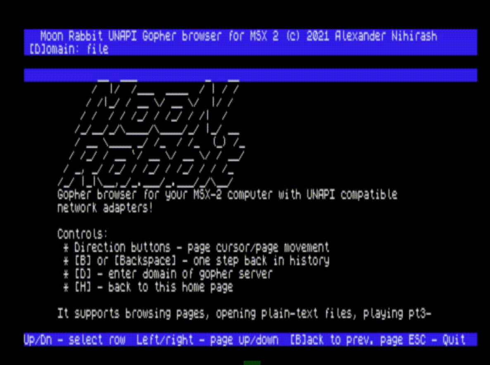

# Moon Rabbit

Gopher browser for MSX2 computers with UnApi Tcp/ip stack.

## Development

To compile project all you need is [sjasmplus](https://github.com/z00m128/sjasmplus).

You may use or not use GNU Make. But for just build enought only sjasmplus: `sjasmplus main.asm`.

To getting working distro you'll need:

 * Compiled binary

 * `font.bin` - font file(it uses first symbols for icons - if you'll want replace font - please make icons too)

 * `index.gph` - starting page that's will be shown on start

Some parts based on my Internet NEXTplorer(for zx spectrum next). 

## Usage

It requires MSX2 computer(uses TEXT2 mode). 

You need have inited unapi tcp/ip driver(ramhelper+inl if you're using obsonet and yourown solutions for other boards) and extracted distro in some directory.

For starting browser just run `moonr.com` and enjoy it.

## Development plan

[X] Publish first version and get first happy users
[ ] Add support for some graphics format
[ ] Maybe something else?

## Sponsorship

Github sponsorship isn't available for Russia.

You can support my work via PayPal(attached email written in [LICENSE file](LICENSE)).

## License

I've licensed project by [Nihirash's Coffeeware License](LICENSE).

Please respect it - it isn't hard.